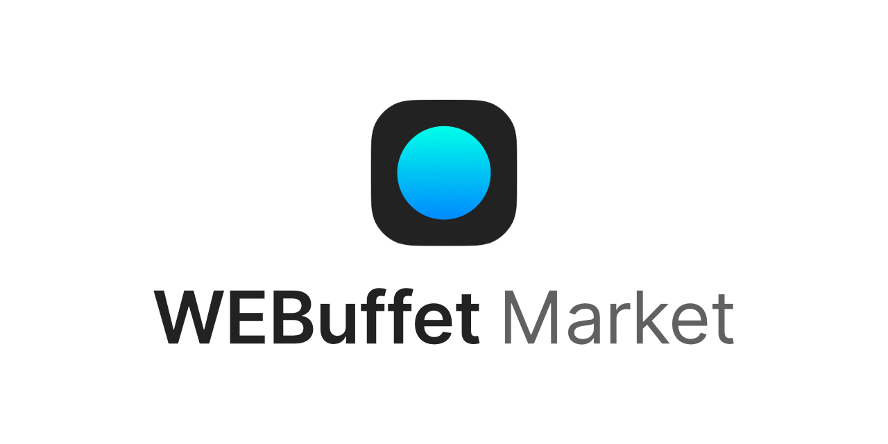

# WEBuffet API server

See our [WEBuffet](https://github.com/CAU-OSS-2019/webuffet) repository.

## Core features

- User identification
  - We identify our user by unique identifier and email which are provided by chrome identity API.
  
- Storage service
  - You can save theme to server. It can help to immediately use saved theme in another pc/laptop.

- Theme market service  
  - You can upload theme to market. It makes to users can check, evaluate, and download each other's themes.

## API document

Our API server is https://api.webuffet.net  
> Not yet supported (2019.05.16)  
> Partially supported (2019.05.26)
> Storage service is fully supported (2019.05.30)

### Storage service

- [<code>GET</code> /storage/user](./API_DOCUMENT/storage/GET_storage_user.md)

- [<code>POST</code> /storage/user](./API_DOCUMENT/storage/POST_storage_user.md)

- [<code>POST</code> /storage/user/thumbnail](./API_DOCUMENT/storage/POST_storage_user_thumbnail.md)

- [<code>PUT</code> /storage/user/theme](./API_DOCUMENT/storage/PUT_storage_user_theme.md)

- [<code>DELETE</code> /storage/user/theme](./API_DOCUMENT/storage/DELETE_storage_user_theme.md)

### Market service
